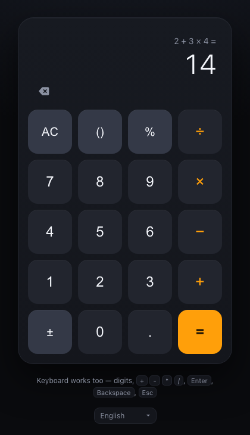
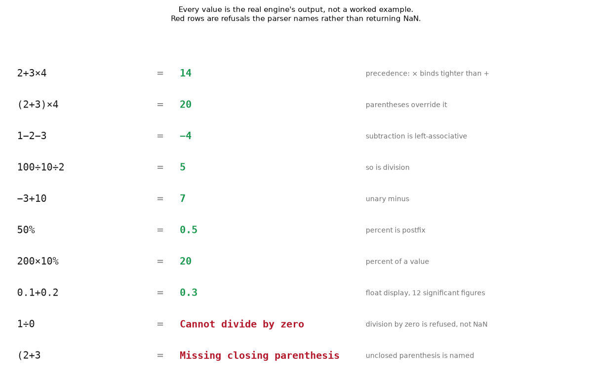
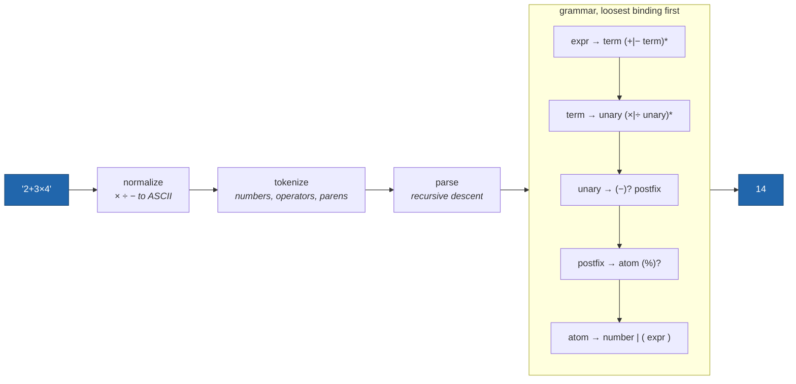

# Calculator, Dark Theme

A dark-theme calculator that runs in the browser. No dependencies, no build step
three static files and a`<script>` tag.

**Live demo: https://aghasalim.github.io/Calculator_Dark_Theme/**

<p align="center">
  
</p>

<p align="center"><sub>Precedence is the point: <code>2 + 3 × 4</code> is 14, not 20.</sub></p>

## Where this came from

This is one of my first projects, something I made as a kid. Back then it lived
on Replit, and this repo never held much more than a link to it, so the code here
is a rebuild rather than a restoration.

I've come back to redesign it properly: a real parser instead of string tricks, a
dark theme I'd actually ship, keyboard support, tests, and a live demo. The idea
is the same one I had as a child. Everything under it is new.

## What the parser actually does



Every value above is produced by calling`engine.evaluate`, the figure is
regenerated by`python3 scripts/make_figures.py`, so it cannot claim behaviour the
parser does not have. The two red rows are refusals it names rather than returning
`NaN`.



Precedence is the shape of the grammar rather than a table of numbers:`expr`
calls`term`, so anything`term` parses binds tighter. That is why`2+3×4` is 14.

## Features

- **Operator precedence and parentheses**:`2 + 3 × 4` is`14`, not`20`. Unclosed
  parentheses are closed for you when you press`=`.
- **Live result preview** under the expression as you type.
- **Full keyboard support**: digits,`+``-``*``/``%``(``)``.`,`Enter` to
  evaluate,`Backspace` to delete,`Esc` to clear,`n` to flip the sign.
- **Readable output**: thousands separators, tabular figures, and a display font
  that shrinks to keep long expressions on one line.
- **Accessible**: real buttons, labelled operators, visible focus rings, results
  announced to screen readers, and animations disabled under
`prefers-reduced-motion`.
- **Sensible errors**: dividing by zero says so instead of showing`Infinity`.
- **Ten languages**: optional interface translation, pinned and integrity-checked.
  See [Translation](#translation).

## Behaviour worth knowing

**Percent is postfix "divide by 100".**`50%` is`0.5`, and`200 × 10%` is`20`.
So`200 + 10%` is`200.1`, *not*`220`, this calculator does not re-interpret`%`
as "percent of the left operand" the way some phone calculators do. The rule here
is the same everywhere it appears, which is the point.

**Results carry 12 significant digits.** That is what hides binary float noise`0.1 + 0.2` displays as`0.3` rather than`0.30000000000000004`. The cost is that
results beyond 12 digits are rounded:`123456789 × 987654321` shows as
`121,932,631,113,000,000`. This is a double-precision calculator, not a
bignum one.

## Layout

| | | | |
|---|---|---|---|
|`AC` |`()` |`%` |`÷` |
|`7` |`8` |`9` |`×` |
|`4` |`5` |`6` |`−` |
|`1` |`2` |`3` |`+` |
|`±` |`0` |`.` |`=` |

`()` is one key: it inserts whichever parenthesis makes sense where you are.

## Files

| File | What it does |
|---|---|
|`engine.js` | Tokenizer, recursive-descent evaluator, number formatting. No DOM. |
|`app.js` | Keypad wiring and input rules, what each key does to the expression. |
|`index.html` /`style.css` | Markup and the dark theme. |
|`test.js` | Self-check for the engine. |

Expressions are parsed by a hand-written recursive-descent parser, so user input
is never handed to the JavaScript interpreter.

## Translation

The picker under the keypad switches the interface between ten languages, using
[translate.js](https://github.com/xnx3/translate) (MIT).

**What gets translated:** the page title, meta description, the keyboard hint,
and the error messages. That is the entire prose surface of this app.

**What never gets translated:** the display, the keypad, and the physical key
names in the hint. These carry`class="ignore"`. This is not a nicety, the
library classifies`×` (U+00D7) and`÷` (U+00F7) as letters, because they sit
inside its`[À-ÿ]` range, so an unfenced display would send fragments of your
arithmetic to a translation engine. Its text handling also turns`1e+21` into
`1 e +21` even when the translation is identical to the input, which would
corrupt any result large enough to render in exponential notation.

Three deliberate choices behind the integration:

- **Pinned, with Subresource Integrity.** Loaded from an immutable cdnjs version
  with a`sha384` hash. The vendor's own URL,`res.zvo.cn/translate/translate.js`,
  is unversioned and rewritten in place, so it cannot carry an`integrity`
  attribute at all.
- **No DOM observer.**`translate.listener.start()` is deliberately not called.
  It exists to catch text added after load, but every dynamic node here is
  numeric output that must not be touched. Error strings are instead rendered
  into the page up front and read back by`app.js`, so they get translated on
  load without an observer running on every keypress.
- **Fails safe.** If the CDN is unreachable or the hash does not match, the
  script is blocked, the picker stays hidden, and the calculator is unaffected.
  Translation is strictly additive.

**What leaves your browser:** switching language sends seven UI strings to
`edge.microsoft.com` (Microsoft Translator). Nothing you type is ever sent, the
display is excluded before any request is made. The library also pings
`api.translate.zvo.cn` on page load even on the`client.edge` channel; a
`connect-src` CSP in`index.html` blocks that. This is why three CSP errors
appear in the console on load, they are expected.

Note for anyone reusing this:`class="notranslate"` and the HTML5`translate="no"`
attribute have **no effect** in this library (verified against the shipped build).
Exclusion is`class="ignore"` only, and it is inherited by the subtree.

## Running it

Open`index.html` in a browser, or serve the folder:

```bash
python3 -m http.server 8000
```

## Tests

```bash
node test.js
```

Covers precedence, associativity, parentheses, unary signs, percent, division by
zero, malformed input, and number formatting. No test framework.

## Licence

MIT
